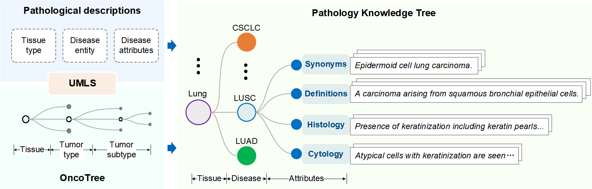
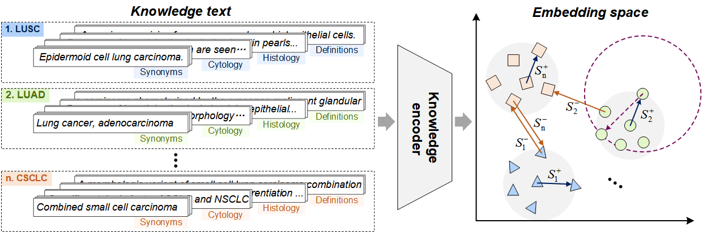
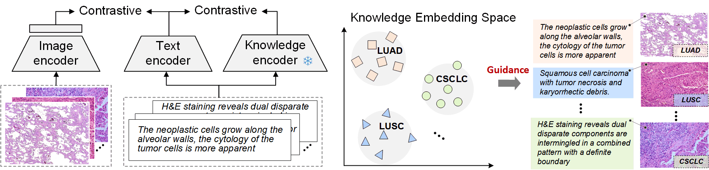

# KEP

The official codes for "[**Knowledge-enhanced Visual-Language Pretraining for Computational Pathology**](https://arxiv.org/list/cs.CV/recent)".

## Dependencies

To install Python dependencies:

```
pip install torch==1.11.0+cu113 torchvision==0.12.0+cu113 torchaudio==0.11.0+cu113 -f https://download.pytorch.org/whl/torch_stable.html
pip install -r requirements.txt
```

## Data

#### **Training Dataset**  

1. Pathology Knowledge Tree (can be found in `./dataset/knowledge_encoder_dataset/`) for knowledge encoding. Based on the structure of OncoTree, we construct a pathology knowledge tree, which contains disease names/synonyms, disease definitions, histology and cytology features. 

<div align=center></div>

2. Navigate to [OpenPath](https://drive.google.com/drive/folders/1b5UT8BzUphkHZavRG-fmiyY9JWYIWZER) to download pathology image-text pairs of OpenPath. Note: you might need to download data from Twitter and [LAION-5B](https://laion.ai/blog/laion-5b/)

3. Navigate to [Quilt1m](https://github.com/wisdomikezogwo/quilt1m) to download pathology image-text pairs of Quilt1m.

#### **Evaluation Dataset**

1. Retrieval: [ARCH](https://warwick.ac.uk/fac/cross_fac/tia/data/arch).

2. Zero-shot Patch Classification: [BACH](https://zenodo.org/records/3632035), [NCT-CRC-HE-100K](https://zenodo.org/records/1214456), [KatherColon](https://zenodo.org/record/1214456), [LC25000](https://academictorrents.com/details/7a638ed187a6180fd6e464b3666a6ea0499af4af),
[RenalCell](https://zenodo.org/records/6528599), [SICAP](https://data.mendeley.com/datasets/9xxm58dvs3/1), [SkinCancer](https://heidata.uni-heidelberg.de/dataset.xhtml?persistentId=doi:10.11588/data/7QCR8S), [WSSS4LUAD](https://wsss4luad.grand-challenge.org/).

3. Zero-shot WSI Tumor Subtyping: [TCGA-BRCA](https://portal.gdc.cancer.gov/v1/repository?facetTab=files&filters=%7B%22content%22%3A%5B%7B%22content%22%3A%7B%22field%22%3A%22cases.project.project_id%22%2C%22value%22%3A%5B%22TCGA-BRCA%22%5D%7D%2C%22op%22%3A%22in%22%7D%2C%7B%22content%22%3A%7B%22field%22%3A%22files.experimental_strategy%22%2C%22value%22%3A%5B%22Diagnostic%20Slide%22%5D%7D%2C%22op%22%3A%22in%22%7D%5D%2C%22op%22%3A%22and%22%7D&searchTableTab=cases), NSCLC: [TCGA-LUAD](https://portal.gdc.cancer.gov/v1/repository?facetTab=cases&filters=%7B%22op%22%3A%22and%22%2C%22content%22%3A%5B%7B%22op%22%3A%22in%22%2C%22content%22%3A%7B%22field%22%3A%22cases.project.project_id%22%2C%22value%22%3A%5B%22TCGA-LUAD%22%5D%7D%7D%2C%7B%22content%22%3A%7B%22field%22%3A%22files.experimental_strategy%22%2C%22value%22%3A%5B%22Diagnostic%20Slide%22%5D%7D%2C%22op%22%3A%22in%22%7D%5D%7D&searchTableTab=cases) and [TCGA-LUSC](https://portal.gdc.cancer.gov/v1/repository?facetTab=cases&filters=%7B%22op%22%3A%22and%22%2C%22content%22%3A%5B%7B%22op%22%3A%22in%22%2C%22content%22%3A%7B%22field%22%3A%22cases.project.project_id%22%2C%22value%22%3A%5B%22TCGA-LUSC%22%5D%7D%7D%2C%7B%22content%22%3A%7B%22field%22%3A%22files.experimental_strategy%22%2C%22value%22%3A%5B%22Diagnostic%20Slide%22%5D%7D%2C%22op%22%3A%22in%22%7D%5D%7D&searchTableTab=cases), [TCGA-RCC](https://portal.gdc.cancer.gov/v1/repository?facetTab=cases&filters=%7B%22op%22%3A%22and%22%2C%22content%22%3A%5B%7B%22op%22%3A%22in%22%2C%22content%22%3A%7B%22field%22%3A%22cases.project.project_id%22%2C%22value%22%3A%5B%22TCGA-KICH%22%2C%22TCGA-KIRC%22%2C%22TCGA-KIRP%22%5D%7D%7D%2C%7B%22content%22%3A%7B%22field%22%3A%22files.experimental_strategy%22%2C%22value%22%3A%5B%22Diagnostic%20Slide%22%5D%7D%2C%22op%22%3A%22in%22%7D%5D%7D&searchTableTab=cases).
Note: The WSIs of TCGA-RCC used in this study keeps the same as [MI-Zero](https://github.com/mahmoodlab/MI-Zero/blob/main/src/data_csvs/tcga_rcc_zeroshot_example.csv)

## Pretrained Model

#### **Pretrained model for text encoder**  

1. [PubMedBERT](https://huggingface.co/microsoft/BiomedNLP-BiomedBERT-base-uncased-abstract-fulltext)

#### **Pretrained model for visual encoder**  

1. CLIP-based: [CLIP](https://huggingface.co/openai/clip-vit-base-patch32), [BiomedCLIP](https://huggingface.co/microsoft/BiomedCLIP-PubMedBERT_256-vit_base_patch16_224), [PMC-CLIP](https://github.com/WeixiongLin/PMC-CLIP).

2. SSL-based: [CTransPath](https://github.com/Xiyue-Wang/TransPath), [PathSSL](https://github.com/lunit-io/benchmark-ssl-pathology#pre-trained-weights)

## Pretraining

**1. Pathology Knowledge Encoding**

Projecting tree-structure pathological
knowledge into a latent embedding space, where the synonyms, definitions, and corresponding histological/cytological features of the same disease are pulled together while those of different diseases are pushed apart. 

<div align=center></div>

Run the following command to perform Pathology Knowledge Encoding:
```
cd ./S1_knowledge_encoding

python main.py 
```
The main hyper-parameters are summarized in `./S1_knowledge_encoding/bert_training/params.py`

**2. Pathology Knowledge Enhanced Pretraining**

Leverage the established knowledge encoder to guide visual-language pretraining for computational pathology.

<div align=center></div>

Run the following command to perform Pathology Knowledge Enhanced Pretraining:

```
cd ./S2_knowledge_enhanced_pretraining

python -m path_training.main 
```
The main hyper-parameters of each model are summarized in `./S1_knowledge_encoding/configs`

## Inference

**1. Zero-shot Patch Classification and Cross-modal Retrieval**

Run the following command to perform Cross-Modal Retrieval:
```
cd ./S3_model_eval

python main.py 
```

**2. Zero-shot WSI Tumor Subtyping**

The code for Zero-shot WSI Tumor Subtyping, please refer to [MI-Zero](https://github.com/mahmoodlab/MI-Zero). Note: You might first need to segment WSI into patches by using [CLAM](https://github.com/mahmoodlab/CLAM), and then implement zeroshot classification on each patch-level images by using [MI-Zero](https://github.com/mahmoodlab/MI-Zero).


## Model Checkpoints

We provide the models' checkpoints for KEP-32_OpenPath, KEP-16_OpenPath, KEP-CTP_OpenPath, KEP-32_Quilt1m, KEP-16_Quilt1m, KEP-CTP_Quilt1m, 
which can be download from [BaiduPan](https://pan.baidu.com/s/1zweaQVQnW30IKm8xyrtsOg?pwd=u8nu) or from google drive with link: (coming soon).


## Citation
If you use this code for your research or project, please cite:

    @misc{zhou2024knowledgeenhanced,
      title={Knowledge-enhanced Visual-Language Pretraining for Computational Pathology}, 
      author={Xiao Zhou and Xiaoman Zhang and Chaoyi Wu and Ya Zhang and Weidi Xie and Yanfeng Wang},
      year={2024},
      eprint={2404.09942},
      archivePrefix={arXiv},
      primaryClass={cs.CV}
    }

